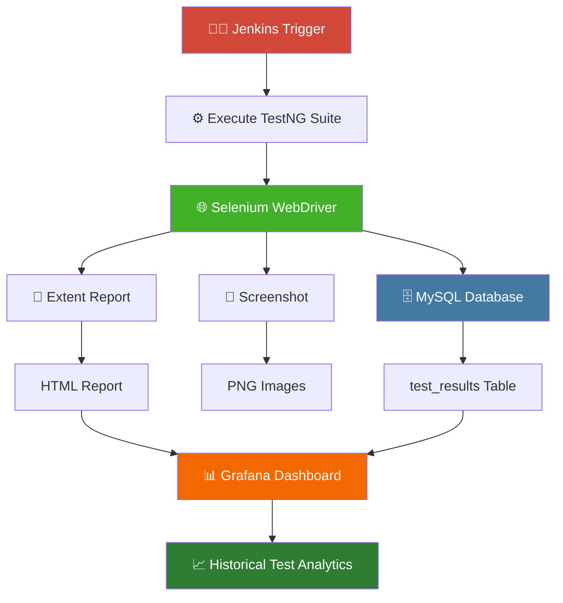
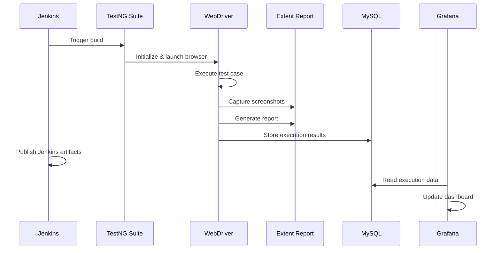
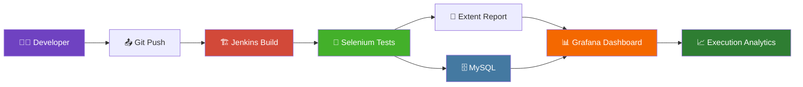
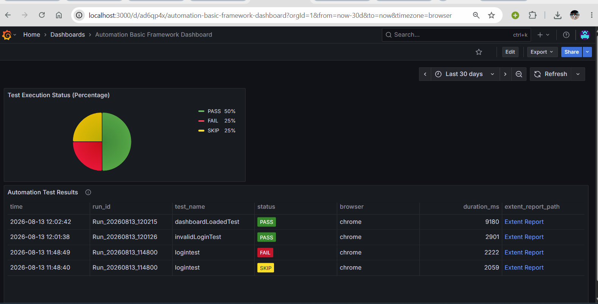
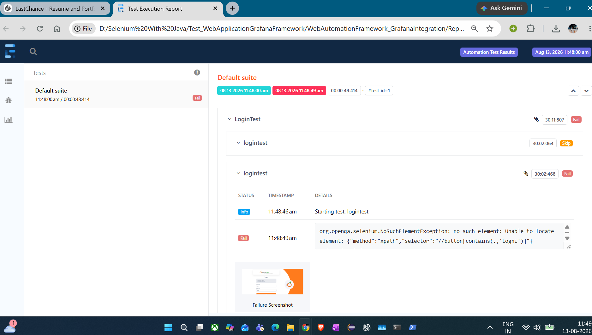
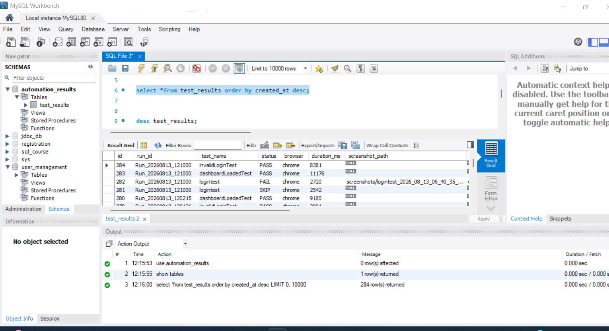
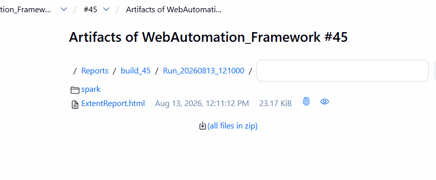

<div align="center">

# 🚀 Web Automation Framework with Grafana Integration

**A scalable Selenium Test Automation Framework** built with Java, TestNG & Maven — featuring full CI/CD integration, MySQL-backed execution history, Extent Reports, and real-time Grafana dashboards.

[](https://www.oracle.com/java/)
[](https://www.selenium.dev/)
[](https://testng.org/)
[](https://maven.apache.org/)
[](https://www.jenkins.io/)
[](https://www.mysql.com/)
[](https://grafana.com/)

⭐ **If you find this project useful, don't forget to star the repo!**

</div>

---

## 📌 Features

| | | |
|---|---|---|
| ✅ Selenium WebDriver Automation | ✅ ThreadLocal WebDriver Management | ✅ Retry Analyzer for Failed Tests |
| ✅ Java + TestNG Framework | ✅ Explicit Wait Utilities | ✅ Screenshot Capture (Pass & Fail) |
| ✅ Maven Build Management | ✅ Extent Reports w/ Screenshots | ✅ MySQL Database Integration |
| ✅ Jenkins CI/CD Integration | ✅ Grafana Dashboard Visualization | ✅ Historical Execution Tracking |
| ✅ Build-wise Report Storage | ✅ Dynamic Report Links | ✅ Modular, Scalable Architecture |

---

## 🛠 Tech Stack

| Category | Technology |
|---|---|
| **Language** | Java |
| **Automation** | Selenium WebDriver |
| **Testing** | TestNG |
| **Build Tool** | Maven |
| **Database** | MySQL |
| **Reporting** | Extent Reports |
| **Dashboard** | Grafana |
| **CI/CD** | Jenkins |
| **IDE** | Eclipse |
| **Version Control** | Git & GitHub |

---

## 🏗 Framework Architecture



---

## 🔄 Test Execution Flow



---

## 💾 Database Integration

Every executed test is automatically stored in MySQL for reporting and dashboard visualization.

**Captured Information**

- Run ID
- Test Name
- Status
- Browser
- Execution Duration
- Screenshot Path
- Exception Details
- Executed By
- Execution Timestamp
- Extent Report Path

---

## 📊 Grafana Dashboard

The Grafana dashboard reads execution data directly from MySQL and provides real-time analytics.

**Dashboard Features**

- 🥧 PASS / FAIL / SKIP Pie Chart
- 📅 Execution History
- 🌐 Browser Details
- ⏱️ Test Duration
- 📆 Execution Timeline
- 🔗 Direct Extent Report Links
- 📜 Historical Test Runs

---

## 📑 Extent Reports

The framework generates interactive Extent Reports after every execution.

**Features**

- Execution Timeline
- Test Logs
- Pass / Fail Status
- Embedded Screenshots
- Exception Stack Trace
- Execution Duration
- Test Categories

---

## 🗄 MySQL Test Results

Each execution is inserted into the database for reporting and dashboard visualization.

---

## ⚙ Jenkins Integration

Every Jenkins build automatically creates versioned reports.

```
Reports/
└── build_45/
    ├── latest/
    │   └── ExtentReport.html
    └── Run_20260813_121000/
        ├── spark/
        ├── screenshots/
        └── ExtentReport.html
```

**Benefits**

- Build-wise Report History
- Latest Report Shortcut
- Archived Reports
- Artifact Publishing
- Easy Report Sharing

---

## 📂 Project Structure

```
WebAutomationFramework
├── src
│   ├── main
│   │   └── java
│   │       └── com.base.framework
│   │           ├── BaseTest.java
│   │           ├── DriverManager.java
│   │           ├── ConfigReader.java
│   │           ├── DbManager.java
│   │           ├── ExtentManager.java
│   │           ├── ExtentReportListener.java
│   │           ├── RetryAnalyzer.java
│   │           ├── ScreenshotListener.java
│   │           ├── TakeScreenshot.java
│   │           └── WaitUtils.java
│   └── test
│       └── java
│           └── com.base.tests
│               ├── LoginTest.java
│               ├── InvalidLoginTest.java
│               └── DashboardValidationTest.java
├── Reports
├── Screenshots
├── pom.xml
└── testng.xml
```

---

## ▶ Running the Project

**Clone the repository**

```bash
git clone https://github.com/atharvajoshibsl/WebAutomationFramework.git
```

**Install dependencies**

```bash
mvn clean install
```

**Execute tests**

```bash
mvn test
```

**Run a specific TestNG suite**

```bash
mvn test -DsuiteXmlFile=testng.xml
```

---

## 📈 Sample Execution Workflow



---

## 🚀 Future Enhancements

- [ ] Parallel Execution
- [ ] Cross Browser Execution
- [ ] Docker Support
- [ ] Selenium Grid
- [ ] GitHub Actions CI/CD
- [ ] Email Notifications
- [ ] Slack Notifications
- [ ] Playwright Integration
- [ ] API Automation
- [ ] Allure Reporting
- [ ] Kubernetes Execution

---

## 🖼 Screenshots

### Grafana Dashboard


### Extent Report


### MySQL Test Results


### Jenkins Artifacts


---

## 👨‍💻 Author

**Atharva Joshi**
*Automation Test Engineer*

[](https://github.com/atharvajoshibsl)
[](https://www.linkedin.com/in/atharva-joshi-a624641ba/)

---

<div align="center">

### ⭐ Star this repo if it helped you!

</div>